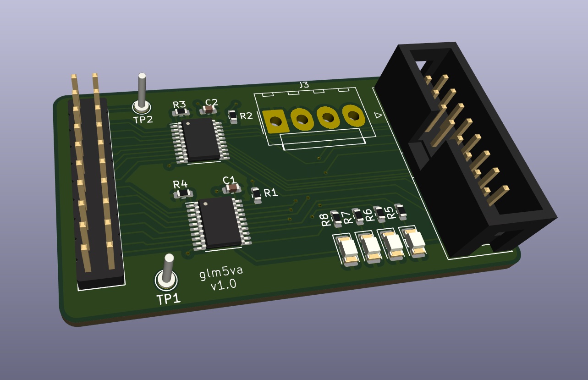

# GateMate 5V Adapt 
 
Little PCB to adapt 2.5v GateMate signals to 5V for matrix Led.

Adapt board for Olimex [GatemateA1-EVB board](https://www.olimex.com/Products/FPGA/GateMate/GateMateA1-EVB/open-source-hardware).

## Gerber

Tutorial to make gerber : https://jlcpcb.com/help/article/how-to-generate-gerber-and-drill-files-in-kicad-8

## Ressources

- [Hub75 with tangnano](https://learn.lushaylabs.com/led-panel-hub75/)
